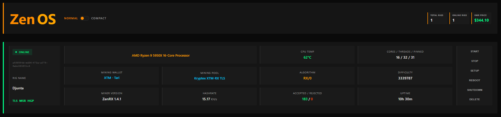
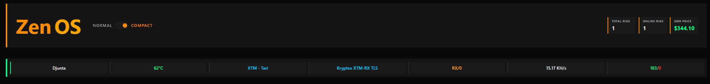

# ZenOS

**CPU Mining Platform - Boot, Click, Mine.**

[](https://zenplatform.dev)
[]()
[](https://github.com/DrZeck/ZenOS/issues)
[](https://github.com/DrZeck/ZenOS/releases)

---

## What is ZenOS?

ZenOS is a complete CPU mining platform. Boot from USB, configure your rig in 3 clicks, start mining.

- **No config files**
- **No command line**
- **No SSH**

Just a web dashboard where you point, click, and mine.

---

## Screenshots

### Normal View


### Compact View


---

## Quick Start

1. **Register** at [zenplatform.dev](https://zenplatform.dev)
2. **Download** your personalized ISO
3. **Flash** to USB ([Rufus](https://rufus.ie/) or [Etcher](https://etcher.balena.io/))
4. **Boot** your PC from USB
5. **Configure** in dashboard: select pool → select wallet → save
6. **Done.** Mining starts automatically.

Total setup time: ~2 minutes.

---

## Features

| Feature | Description |
|---------|-------------|
| **3-Click Setup** | Pool, wallet, save. That's it. |
| **Auto-Setup** | Configure all unconfigured rigs at once |
| **Web Dashboard** | Monitor all rigs from one place |
| **Real-time Stats** | Hashrate, temperature, shares, uptime |
| **Remote Control** | Start/stop/reboot from anywhere |
| **Debug Mode** | See everything on the rig's monitor |
| **TLS Support** | Secure pool connections |

---

## Pricing

**1% miner fee** - covers the entire platform.

No subscriptions. No per-rig costs. No hidden fees.

---

## Multiple Rigs?

Boot all your rigs. In the dashboard, click **Auto-Setup**. 

All unconfigured rigs get the same pool and wallet instantly.

50 rigs? Same 3 clicks.

---

## Transparency

Don't trust, verify.

Enable **Debug Mode** in rig settings. The connected monitor shows everything:
- Pool connections
- Hashrate
- Shares submitted
- Algorithm
- Everything the miner does

---

## ZenRX Miner

ZenRX is the miner that powers ZenOS. Optimized for RandomX.

### Releases

Pre-compiled binaries available in [Releases](https://github.com/DrZeck/ZenOS/releases):

| Platform | File |
|----------|------|
| Linux | `zenrx-linux-x64.tar.gz` |
| Windows | `zenrx-windows-x64.zip` |

### Standalone Usage

You can run ZenRX outside of ZenOS:

```bash
./zenrx -o pool.address:port -u YOUR_WALLET -p rig_name
```

See `./zenrx --help` for all options.

---

## Supported Pools

**Presets:**
- MoneroOcean (algo-switching)
- SupportXMR
- Kryptex (XMR, XTM, ZEPH, SAL)

---

## Supported Algorithms

- rx/0 (Monero)
- rx/wow (Wownero)  
- rx/arq (ArQmA)
- rx/graft (Graft)
- rx/sfx (Safex)
- rx/keva (Kevacoin)
- rx/xla (Scala)

---

## System Requirements

- x86_64 CPU (Intel or AMD)
- 4GB+ RAM
- USB port
- Network connection

---

## FAQ

**What does the 1% fee cover?**
> Everything.

**Can I use my own pool?**
> No. Only pool presets in UI.

**How do I know the miner isn't doing something shady?**
> Enable Debug Mode. Everything is displayed on the rig's monitor.

**Do I need to install anything on the PC?**
> No. ZenOS boots from USB. The PC's hard drive is not touched.

---

## Issues & Feedback

Found a bug? Have a suggestion?

👉 [Open an issue](https://github.com/DrZeck/ZenOS/issues)

---

## Links

- 🌐 **Platform:** https://zenplatform.dev
- 📥 **Releases:** https://github.com/DrZeck/ZenOS/releases
- 🐛 **Issues:** https://github.com/DrZeck/ZenOS/issues

---

## License

ZenRX binaries are provided as-is.

---

**Made by DrZeck**
